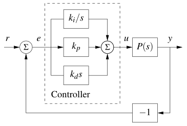

# CarND-Controls-PID
Self-Driving Car Engineer Nanodegree Program

---

4th project of term 2 of Udacity's Self-Driving Car nanodegree

This project builds on the original repository [here](https://github.com/udacity/CarND-Controls-PID). You can find dependencies and build instructions there.


The project asks for the implementation of a PID (Proportional-Integral-Derivative) controller for the car in [Term 2 Simulator](https://github.com/udacity/self-driving-car-sim/releases). The car has to complete a lap on the circuit without going out of the lane.


## PID Controller

>Graphics for this section were taken from _Feedback Systems: An Introduction for Scientists and Engineers_ by Karl Johan Astrom and Richard M. Murray

The simulator sends the actual telemetry values for Speed, Steer Angle and CTE (Cross-Track Error) to the controller. The controller uses the PID control law to compute a steer angle that reduces the error. This steer angle is sent to the simulator which applies it and the loop repeats.

The PID controller has the following expression:


where

_kp_ is the proportional constant

_ki_ is the integral constant

_kd_ is the derivative constant

Those are the three parameters we have to modify the behaviour of the controller. Each one has an effect on the output, which is then subtracted from the input (negative feedback) to get the error, which is sent again to the controller. In blocks:



The input _r_ is the reference value. The controller tries to get the output _y_ to follow it by substracting the calculated output from the reference input to get the error. In other words, if the car is out of the center of the lane (error) the controller will generate a steer angle that will bring the car to the center again.

The proportional part of the controller brings a value proportional to the error: if the error is big, the proportional response will be big. This generates a response in the correct direction, but the car will certainly _overshoot_ the center because the control signal will continue driving the steering on the direction contrary to the error until the car goes to the other side of the center and the error changes sign; then the control signal will change sign too and the process repeats in the other direction. The bigger the proportional constant, the bigger the oscillation.

The derivative part of the controller aports a signal proportional to the _rate of change_ of the error; if the error is changing rapidly, the derivative portion will be bigger than if the error is changing slowly. This helps to _damp_ the response of the proportional term so the overshoot can be reduced and the reference value approached over time. There will usually be an offset due to the model parameters drift.

The integral part allows the controller to eliminate the offset or _steady-state_ error: the reference value can be reached exactly over time. The bigger the integral constant, the faster the reference value will be reached; but it can also cause oscillations.


The controller implemented is a complete PID. The code is in class PID:

```C++
void PID::UpdateError(double cte) {
  p_error = cte;
  d_error = (cte-prev_cte);
  i_error += cte;
  prev_cte = cte;
}

double PID::getSteerValue(double cte) {
  UpdateError(cte);
  double steer = -(Kp * p_error + Kd * d_error + Ki * i_error);
  prev_cte = cte;
  sum_cte += cte;
  if (steer < -1.0) steer = -1.0;
  if (steer > 1.0) steer = 1.0;
  return steer;
}
```

Here we consider unitary time steps.

## Parameter tuning

Get the best parameters for the problem at hand can be a difficult task. All three parts of the controller act together to get the reference following we look for. If the model is known and the input is stable enough, we could develop a theoretical model and do a frequency or time analysis to get the best parameter values. But in this case, we have a dynamic system that changes on each step (there are curves in the road and the car speed changes in response to the steering) so it is difficult to find a good suite of parameters. Also, the values found to behave correctly for a given velocity may not work for a faster car due to delays in the measurements and setting of the control action.

I set the parameter values through a series of trials, conducted in some way by the effect I wanted to obtain.

I tried first a fully proportional controller (_Kd_ = _Ki_ = 0) and observe the car going from side to side, the bigger the speed the bigger the oscillation.

Then added the integral action setting _Ki_ to a value greater than 0. The car behaviour got much better, though it still performed some 'jerking' at the curves.

Finally, adding the derivative action with _Kd_ > 0 allowed the car to perform _almost_ stable in the rect parts of the circuit and dampen a little the oscillations on the curves.

The effect is not perfect though; a certain amount of oscillation is still in effect specially at higher speeds. A better control law will be needed to reduce or eliminate this.

## Conclusion
This project is a good introduction to the practicalities of the PID controller. The controller is very easy to implement and get a good enough result at slow speeds. At higher speeds though the control is not good enough and the car can end out of the road if the oscillation is big.
